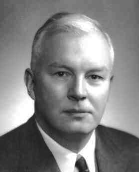

# Agenda

- \hyperlink{intro}{Introduction}

- \hyperlink{conclusion}{Conclusion}

# 

\section{Introduction}
\label{intro}

# Introduction

A citation here to test the markdown [@necula:pcc]

# Next page of the presentation

- We can include latex!

\begin{equation*}
\sigma = \frac{1}{2} \left( \frac{1}{\sqrt{2 \pi}} \exp \left( -\frac{1}{2} \left( x - \mu \right)^2 \right) \right)
\end{equation*}

# 

\section{Conclusion}
\label{conclusion}

# Conclusion

Images in markdown format!

{ width=30% }

# References {.allowframebreaks}

\bibliographystyle{apalike}
